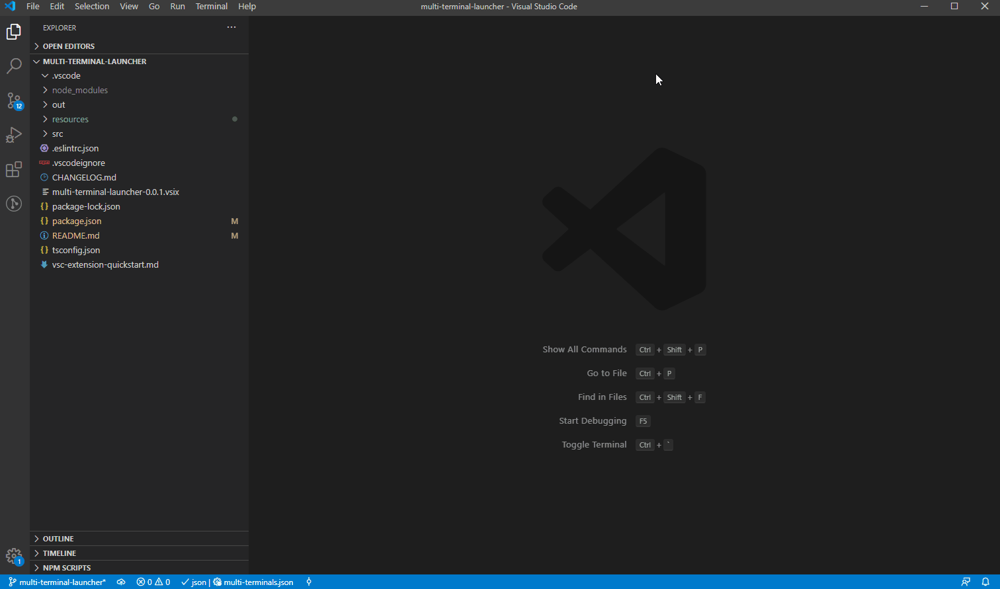
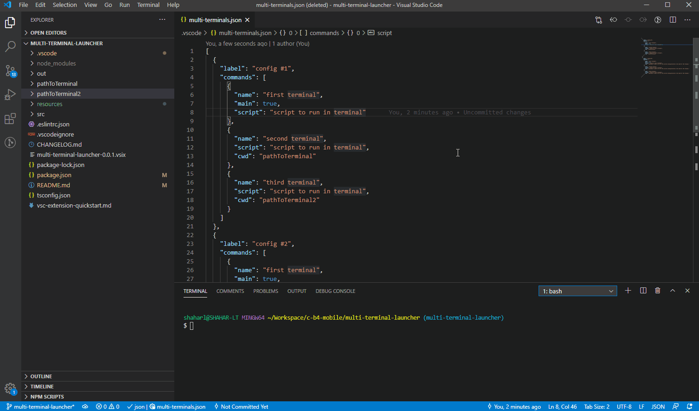

# Multi Terminal Launcher


An extension that allows multiple terminals setups configuration (with commands).

The extension is configured using a very easy to edit JSON (multi-terminals.json).

<br/>

## Configuration

> {workspace.rootPath}/.vscode/multi-terminal.json

```
[
  {
    "label": "config (#1)",
    "commands": [
      {
        "name": "first terminal",
        "main": true, //<optional>
        "script": "script to run in terminal",
        "cwd": "<optional> A path or Uri for the current working directory to be used for the terminal."
      },
      {
        "name": "second terminal",
        "script": "script to run in terminal",
        "cwd": "<optional> A path or Uri for the current working directory to be used for the terminal."
      },
      {
        "name": "third terminal",
        "script": "script to run in terminal",
        "cwd": "<optional> A path or Uri for the current working directory to be used for the terminal."
      }
    ]
  },
  {
    "label": "config (#2) <optional>",
    "commands": [
      {
        "name": "first terminal",
        "main": true, //<optional>
        "script": "script to run in terminal",
        "cwd": "<optional> A path or Uri for the current working directory to be used for the terminal."
      },
      {
        "name": "second terminal",
        "script": "script to run in terminal",
        "cwd": "<optional> A path or Uri for the current working directory to be used for the terminal."
      },
      {
        "name": "third terminal",
        "script": "script to run in terminal",
        "cwd": "<optional> A path or Uri for the current working directory to be used for the terminal."
      }
    ]
  }
]
```

<br/>

## Usage

One new command to the command palette:

```js
Launch Terminal Setting
```

<br/>

### First time using the extension?

If it's the first time you are using the extension and the json file isn't set yet, the extension will toast you with option to create one for you (with template).



<br/>

### Already have configured the JSON?

Then, a VScode drop down will ask you which of the setups you wish to run.



<br/>

if you configured only one setup, the setup will run without prompting the drop down

<br/>

**Enjoy!**
